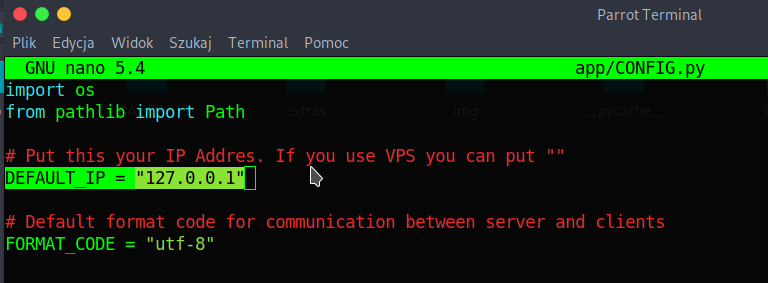
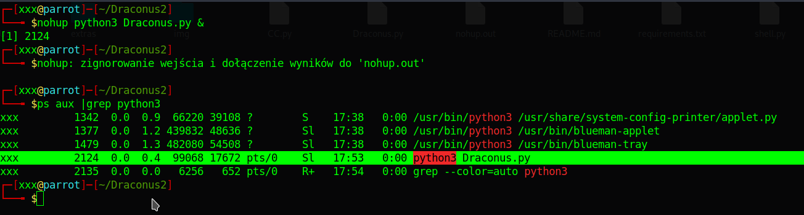
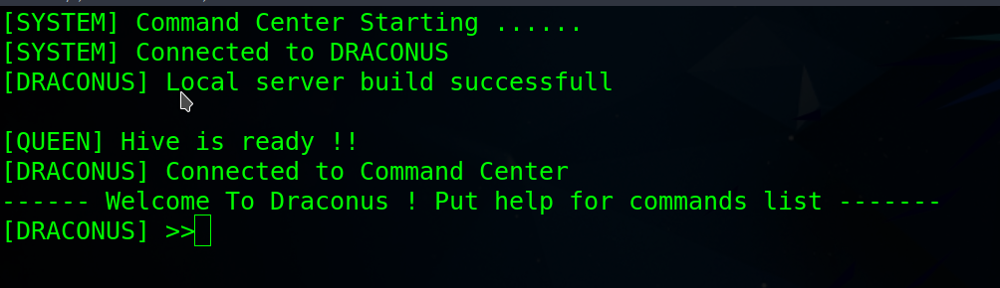
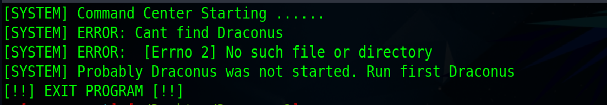
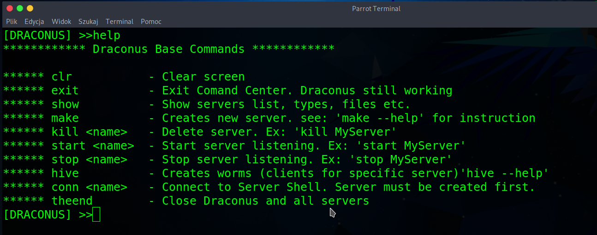
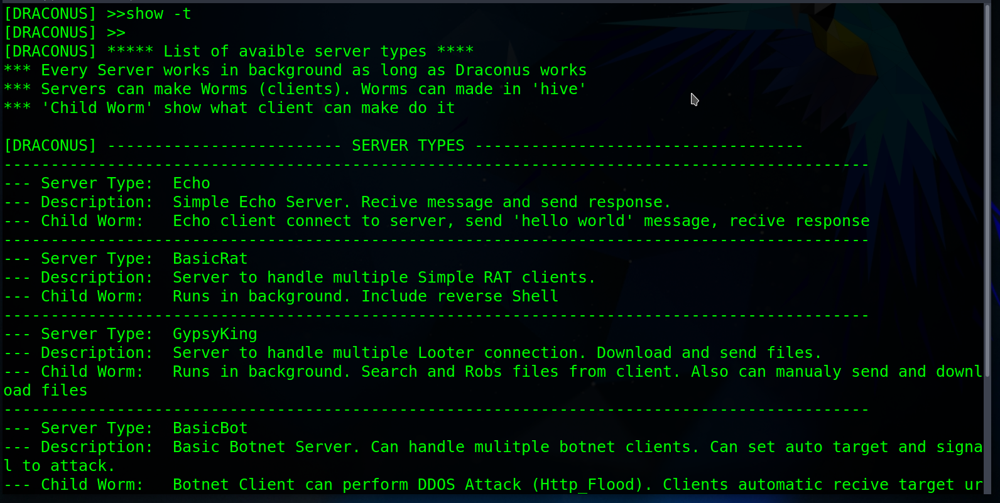

<br />
<div id="intro" align="center">
  <a href="https://github.com/LittleAtariXE/Draconus2">
    
  </a>

  <h1 align="center">DRACONUS</h1>

  <p align="center">
    <h3> This code does NOT promote or encourage any illegal activities! The content of this document is for educational purposes only, intended to raise awareness and learn the Python language and in particular the socket module </h3>
    <h3> May this be a warning to both you and your family. Don't download software that you don't trust. Only download software from reputable software developers and those you trust.</h3>
  </p>
</div>
   <br />
  <div align="center">
    <a href="https://github.com/LittleAtariXE/Draconus2#intro"><strong>Intro »</strong></a>
    ·
    <a href="https://github.com/LittleAtariXE/Draconus2#about">About</a>
    ·
    <a href="https://github.com/LittleAtariXE/Draconus2#whatis">What is Draconus</a>
    ·
    <a href="https://github.com/LittleAtariXE/Draconus2#how_works">How Draco Works</a>
    <br/>
    <h4><a href="https://github.com/LittleAtariXE/Draconus2#letsplay">Let's Play</a></h4>
    <br/>
    <h4><a href="https://github.com/LittleAtariXE/Draconus2#before">Before Start</a><h4>
    <br/>
    <a href="https://github.com/LittleAtariXE/Draconus2#install">Install</a>
    ·
    <a href="https://github.com/LittleAtariXE/Draconus2#firstrun">First Run</a>
    ·
    <a href="https://github.com/LittleAtariXE/Draconus2#help">Help</a>
    ·
    <a href="https://github.com/LittleAtariXE/Draconus2#myfirst">My First Server</a>
</div>

  <br/>
  
  <div id="about" align="center">
    <h2> ABOUT </h2>
    <h4> I created this project primarily to gain a better understanding of how network sockets work in Python, and also as a fun exploration of Processes and Threads. After many, many... hours of work and testing with network sockets, I can only say one thing: "You can get a serious brain workout!" 😄 </h4>
    <h4> However, it seems to me that I've managed to create servers and clients that, to some extent, can work together (recover connections, avoid hanging, etc.). Nevertheless, strange "things" can still happen, and network sockets may behave in quite peculiar ways. </h4>
    <h4> In any case, I invite you to test and improve this project, as someone else might be able to tame those "network sockets." Good luck!</h4>
  </div>

  

<div id="whatis" align="center">
    <h2> What is "Draconus"? </h2>
    <h4> Draconus is a background-running program. Through another program called "Command Center," we connect to Draconus. Draconus enables the creation of various types of servers. These servers run as separate processes in the background but remain dependent on Draconus. As long as Draconus is running, all servers created by us will keep running.</h4>  
    <h4> The advantage of this setup is that you can safely disconnect from Draconus (using the Command Center), and it will continue to run alongside the servers as "Daemon Processes" in the system. </h4>  
    <h4> Draconus allows you to create an unlimited number of servers (I mean, I didn't introduce any limitations) until your CPU explodes! 😄 Each server is capable of handling connections from multiple clients simultaneously, managing those connections, receiving and sending messages or commands. Feel free to test the endurance of the servers, i.e., how many clients they can handle simultaneously and communicate with.</h4>  
    <h4> You're welcome to test and see how robust these servers are! </h4>
</div>
  

<br/>

<div id="how_works" align="center">
  <br/>
  <h2> How Draco Works </h2>
  <h4>Due to its nature, Draconus operates exclusively on the Linux operating system. Because of its use of the Python `multiprocessing` module, this program may not function properly on Windows. However, client-type programs created using Draconus for connecting to servers are compatible with all systems that have Python installed.</h4>

  <h4>To run Draconus, you execute it as a background process (e.g., by using the "nohup" command). Draconus and every server it creates run continuously in the background as separate processes, each having its own log file.</h4>


<h4> **Each server has its own separate log file** and features a "Messenger" responsible for communication with users and logging server events. When working with Draconus, you can see its messages and those of the servers in real-time (courtesy of Messenger). When you disconnect from Draconus, Messenger continues to log messages to the file while buffering them. Upon reconnecting to Draconus, you'll receive all the pending messages that have accumulated since your last connection.</h4>
<h4>Therefore, even when you're not currently connected to Draconus, you can review messages and events by examining the continuously updated log file.</h4>
<h4>With Draconus, you connect using the Command Center. Command Center makes use of the "click" and "click-shell" libraries, providing you with a command-line interface with commands, parameters, and help. The console has two levels. The first level is where you interact with Draconus, creating servers, starting, closing, exporting, and performing other actions. The second console level operates after connecting to a previously created server. Each server may have slightly different commands, depending on its specifications (a "help" command is always available with a list of commands). From this level, you can also send messages and commands to connected clients on the server.</h4>
<h4>Draconus generates ready-to-use clients for each server; all you need to do is start them. Messages sent between clients and the server are not yet fully encrypted (I'm working on it), and they currently undergo a simple message format transformation to "Base64." Special messages are additionally padded with randomly generated character strings (similar to headers) to confuse potential eavesdroppers. Of course, everything is configurable, but if you don't want to delve into the details, you don't have to. Draconus is designed to work very well with default settings. The only thing you need to set in the configuration is your IP address, which can be found in the "CONFIG.py" file.</h4>
<h4>Draconus can also be started as a regular program using the command "python3 Draconus.py." In this case, you'll need to open a second terminal to run the "Command Center."</h4>

<br/>
**Python Libraries Used in Draconus:**
<h4>Jinja2</h4>
<h4>Click</h4>
<h4>Click-Shell</h4>

<h4>Clients created by Draconus only require pure Python, with no additional libraries.</h4>

</div>
<br/>
<div id="letsplay" align="center">
  <h2>Lets Play</h2>
  
</div>
<div id="before" align="center">
  <h3>Before Start</h3>
  <h4>I STRONGLY RECOMMENDED: Uses Draconus and clients only in Virtual Machine. You can serious DAMAGE your System</h4>
  <h4>Some Clients can perform "http_flood" and other attack. YOU ARE RESPONSIBLE FOR USING THIS TOOL CORRECTLY !!!</h4>
  <h4>Don't attack other users' sites or infect their systems !!!!</h4>
</div>
<br/>
<div id="install">
  <h3 align="center">Installation</h3>

  **Basic Requirements:**

- Linux Operating System (tested on Parrot and Kali)
- Python 3.9

1. Clone the repo
   ```sh
   git clone https://github.com/LittleAtariXE/Draconus2
   ```
2. Change directory
   ```sh
   cd Draconus2
   ```
3. Install requirements
   ```sh
   pip install -r requirements.txt
   ```
</div>
<br/>
<div id="firstrun">
  <h3 align="center">First Run</h3>

   **First steps:**
   
1. Navigate to the "Draconus" directory using the command:
  ```sh
  cd Draconus2
  ```

2. If you wish to change the default IP address of the servers you create, you must edit the CONFIG.py file.
   <br/>
   In the CONFIG.py file, you will find numerous parameters such as code formatting, length of received packets, etc. If you wish, you can experiment with different settings. If something doesn't work as expected, you can adjust them. However, the only parameter you really need to concern yourself with is "DEFAULT_IP." You don't need to worry about the rest.


  ```sh
  nano app/CONFIG.py
  ```
  <p align="center">
    
  </p>

3. Use the `nohup` command to run programs in the background. Execute the command:
  ```sh
  nohup python3 Draconus.py &
  ```
4. After starting Draconus, a directory named "DRACONUS" will be created in its folder. This directory will store log files, payloads, and the client programs created by Draconus.
   When you run the command `ps aux | grep python3`, you should see the "Draconus" process in the list of active processes, indicating that it is running in the background. If you wish, you can explore the "DRACONUS/OUTPUT" directory where log files are located, allowing you to review them in real-time.

    
    <br/>
    


6. In the "DRACONUS" directory, you will find the following files and directories:
   - **OUTPUT**: A directory containing Draconus and server logs. Each server has its own log file and a directory for downloaded files.
   - **HATCHERY**: A directory with created client programs.
   - **Config**: A directory where server configurations are stored and can be imported later.
   - **sys_headers.txt**: A special file containing a random character string. It serves as a separator for special commands sent by clients to the server. This file and character string are created each time they are not present. If you delete this file and restart Draconus, a new character string will be generated. Therefore, old client programs using the old "sys_headers" won't be able to cooperate with servers using the new "sys_headers."

7. If you don't see some directories after the first run, don't worry. Additional directories will be created when needed.

8. So, Draconus operates in the background until you kill the process or send a command to shut it down. To connect to Draconus, we'll be using the so-called "Command Center." This program is written using the "Click" library, so it mimics a console. The HELP command is always available, and many commands have additional help accessible via "--help." The operation principles resemble a system console: there are commands and parameters, and by using the "UP" and "DOWN" keys, you can access the command history.

9. When you exit the "Command Center," Draconus and all the created servers will continue running in the background. Therefore, you can easily run Draconus even on a VPS and connect via SSH, launching the Command Center.

   To start the Command Center, use the command:
     ```sh
     python3 START.py
     ```
     <p align="center">
       
     </p>
<br/>
9. If the Command Center throws an error and fails to connect to Draconus, it means:
  <p align="center">
    
  </p>
<br/>  Draconus hasn't been started. You need to start Draconus first.
<br/>  Draconus encountered an error and stopped working (I spent a lot of time testing, so this shouldn't happen). Check Draconus log files for more information.
<br/>
</div>
<br/>
<div id="help">
  <h3 align="center">HELP</h3>
  <p align="center">
     
  </p>
  <p><strong>clr</strong> - Clear Screen</p>
  <p><strong>exit</strong> - Exit Command Center. Draconus and created servers continue to operate (receive, send, etc.). After exiting CC, you can reconnect by restarting "python3 START.py."</p>
  <p><strong>show</strong> - Displays a list of created servers, a list of server types that can be created, etc. See "show --help" for more information.</p>
  <p align="center">
     
  </p>
</div>

<br/>
<div id="myfirst">
  <h3 align="center">My First Server</h3>
</div>

<br/>

